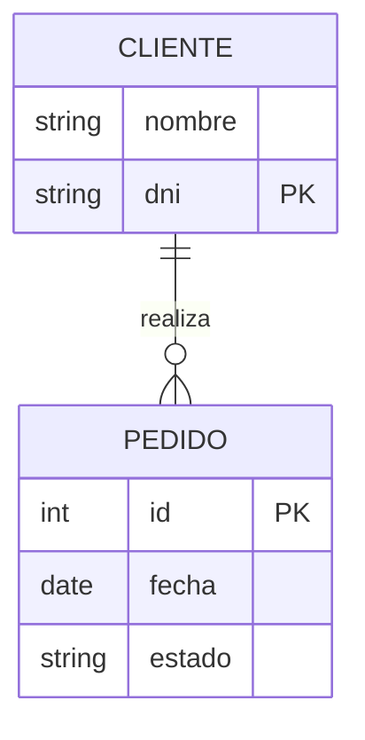

# � **Entidades**  

## 📌 Representación básica  
▫️ Cuando mencionamos el nombre de una entidad por lo general lo hacemos de forma plural, por ejemplo:  
   - 🖥️ `Laptops`  
   - 🚗 `Autos`  
   - 👥 `Clientes`  
▫️ Cada entidad se encierra en un rectángulo.  

---  

## 🏷️ **Tipos de entidades**  

### 🦾 **Entidades fuertes**  
▫️ Son entidades que pueden existir independientemente.  
▫️ *Representación:* ▭ (rectángulo simple)  

### � **Entidades débiles**  
▫️ No pueden existir sin una entidad fuerte.  
▫️ *Representación:* ⏹️ (cuadrado con doble línea)  

#### Tipos de entidades débiles:  
- **Por identidad:**  
  ▫️ Solo se diferencian por la clave de su entidad fuerte.  
- **Por existencia:**  
  ▫️ Se les asigna una clave propia.  

---  

## 🗂️ Representación en bases de datos  
▫️ Existen varias notaciones para modelos Entidad-Relación:  

| Elemento               | Símbolo/Notación          |
|------------------------|--------------------------|
| Entidad débil          | Atributo                 |
| Entidad fuerte         | Atributo llave           |
| Relación               | Atributo llave débil     |
| Relación identificante | Atributo derivado        |
| Entidad asociativa     | Atributo multivaluado    |

---  

## 🔗 **Relaciones**  
▫️ Permiten conectar entidades entre sí.  
▫️ *Representación:* ◆ (rombos)  
▫️ Se definen mediante verbos (ej: "compra", "pertenece", "gestiona").  

---  

## 🔢 **Cardinalidad**  
▫️ Indica cuantitativa de las relaciones:  

| Tipo       | Símbolo | Ejemplo                                  |
|------------|---------|------------------------------------------|
| **1:1**    | 1──1    | 1 presidente → 1 país (y viceversa)      |
| **0:1**    | 0──1    | Usuario puede estar offline (0) o online (1) |
| **1:N**    | 1──N    | 1 persona → N autos (1 auto → 1 dueño)   |
| **0:N**    | 0──N    | N habitaciones pueden estar vacías (0)   |
| **N:N**    | N──N    | N alumnos ↔ N clases                     |

---  

## 📊 **Diagrama ER (Entidad-Relación)**  

▫️ Funciona como un mapa que muestra:
  - 🟦 Entidades relevantes
  - 🔶 Relaciones entre ellas
  - 🔢 Cardinalidades correspondientes
  - � Roles en el sistema de datos

(Diagrama ejemplo: Clientes realizan Pedidos)

