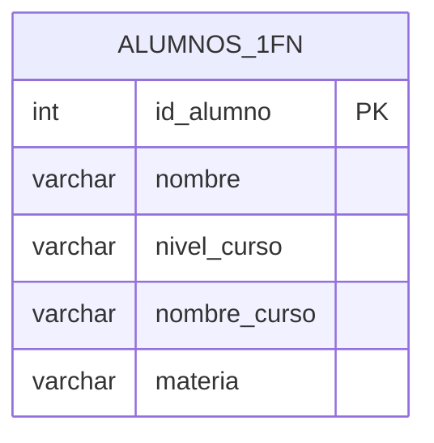
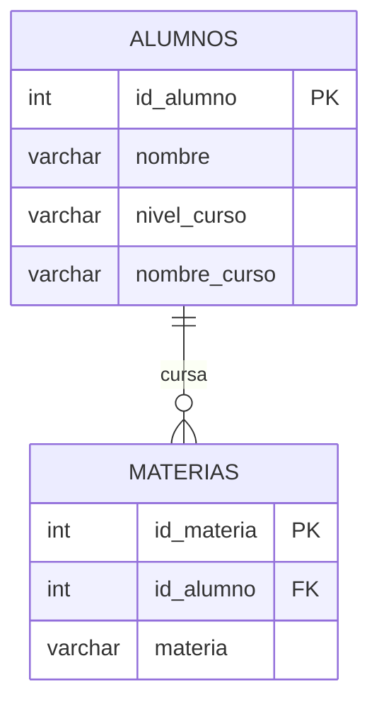
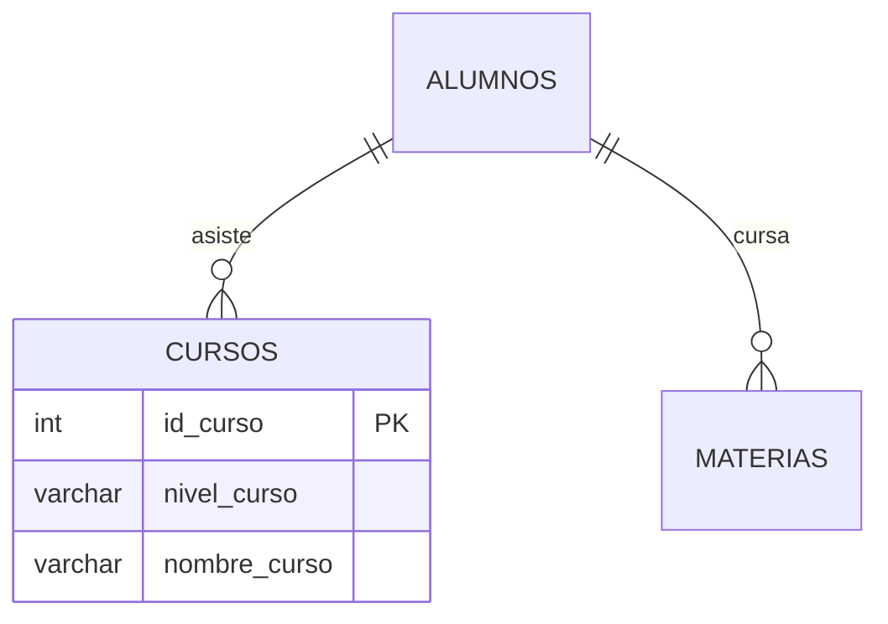
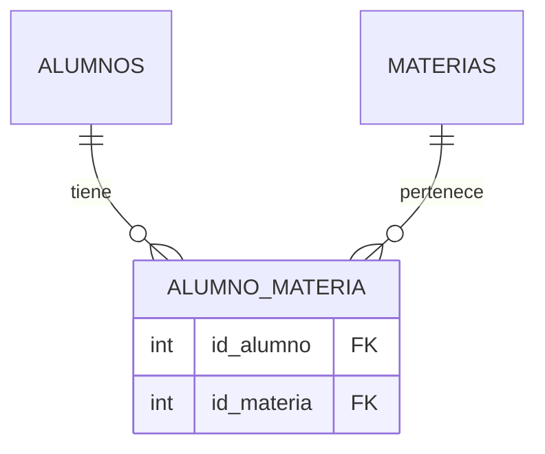

# 🧮 **Normalización de Bases de Datos**

## 🔍 Concepto Básico
▫️ Proceso de descomposición de tablas en estructuras más pequeñas y especializadas  
▫️ Se establecen relaciones mediante claves (IDs)  
▫️ **Beneficio clave:** Actualizar un dato en un solo lugar propaga los cambios automáticamente  

---

## 📉 Ejemplo Inicial (Tabla Sin Normalizar)

**Problemas evidentes:**
- Datos repetidos
- Estructura anidada
- Dificultad para actualizar

---

## 📐 Formas Normales

### 1️⃣ **Primera Forma Normal (1FN)**

Reglas:
- ✅ Eliminar valores repetidos y no atómicos
- ✅ Cada campo no clave debe depender únicamente de la clave primaria
- ✅ Los datos mantienen significado al reordenar registros/columnas

Resultado:

---

### 2️⃣ **Segunda Forma Normal (2FN)**

Reglas:
- ✅ Cumplir 1FN
- ✅ Cada campo debe depender completamente de la clave primaria
- ✅ Separar entidades independientes

Resultado:

---

### 3️⃣ **Tercera Forma Normal (3FN)**

Reglas:
- ✅ Cumplir 2FN
- ✅ Eliminar dependencias transitivas (campos que no dependen de la clave)
- ✅ Separar conceptos lógicos

Resultado:
- 3FN aplicada

---

### 4️⃣ **Cuarta Forma Normal (4FN)**

Reglas:
- ✅ Cumplir 3FN
- ✅ Atomizar datos multivaluados
- ✅ Eliminar toda redundancia mediante tablas puente

Resultado:
- 4FN aplicada

---

## **💡 Beneficios de la Normalización**
1. 🚫 Elimina redundancia de datos
2. 🔄 Facilita actualizaciones (cambios en un solo lugar)
3. 🛡️ Protege la integridad de los datos
4. 💾 Optimiza espacio de almacenamiento
5. ⚡ Reduce complejidad en revisiones
6. 🛑 Previene borrados accidentales
