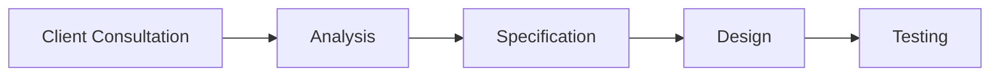

# 🚀 Website Development

---

## 🔄 1. Website Development Process  
### 🛠️ Key Steps:  
1. **📝 First**: Discuss client requirements and target audience  
2. **🔍 Next**: Analyze gathered information  
3. **📋 Then**: Create website specification  
4. **🎨 After that**: Design and develop website  
5. **✅ Finally**: Test and publish website  

**📊 Flowchart Example**:  

---

## 💬 2. Language: Describing Steps
### 📌 Useful Phrases:
- Sequencing:
  - *First, Next, Then, Finally*
- Example:
  - *"First, gather client requirements. Next, create mockup."*

---

## 🗣️ 3. Speaking & Reading Activities
### 🌐 Website Analysis:
- Example Questions:
  - What is Amazon.com's purpose? → Sell products
  - Main features? → Product listings, shopping cart, reviews

### 💼 Developer-Client Dialogue:
- Key Questions:
  - "What is your primary business?"
  - "Who is your target audience?"

---

## 📖 4. Vocabulary (Describing Websites)
### ✨ Adjectives:
- *"Google is the most **user-friendly** website"*
- *"Wikipedia is highly **informative**"*

---

## ✔️ 5. Essential Webpage Features
### 🧰 Checklist:
| Característica       | Descripción                          |
|-------------------------|--------------------------------------|
| 🧭**Clear Navigation** | • Menú de navegación • Búsqueda   |
| 📱**Responsive Design**| • Compatible con móviles • Carga rápida |
| 🔍**SEO Optimization** | • Meta tags • Palabras clave      |

---

## 📄 6. Proposal Template (Learning Now Ltd.)
| 📌 Section  | 📋 Content                          |
|------------|------------------------------------|
| 🎯**Purpose** | Promote online language courses   |
| 👥**Users**   | Young adults globally             |
| ✨**Features** | Interactive tools, audio support |

---

## 🎤 7. Presentation Skills
### 🔤 Vocabulary Matching:
1. **to unveil** → c. Show something first time
2. **Gantt chart** → g. Project timeline

### 🗣️ Presentation Phrases:
- **Structure**: "Firstly, I'll discuss key features"
- **Conclusion**: "In summary, this targets tech-savvy users"
