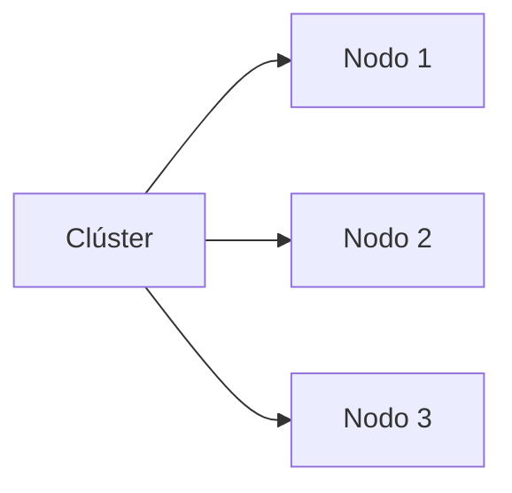

# 🍃 **Bases de Datos No Relacionales (NoSQL)**

## 🧩 **Bases de Datos NoSQL**
- Conjunto de datos **no relacionales** que no utilizan SQL como lenguaje principal
- Manejo de datos mediante **documentos flexibles** en lugar de tablas rígidas

### 🚀 **VENTAJAS**

#### 🛠️ Productividad
```diff
+ Modelo de datos que se adapta a las necesidades de las aplicaciones
+ Facilitó migraciones masivas desde bases relacionales
```

### 📈 Datos a Gran Escala

- Diseñada para operar en clústeres distribuidos
- Capacidad para manejar grandes volúmenes de datos

### 🔍 Características Principales
- ❌ No utiliza SQL como lenguaje principal
- 🔓 Generalmente de código abierto
- � Sin esquema fijo (schemaless)

---

## **📌 Modelos NoSQL**
### 1. 🔑 Modelo Clave-Valor
```json
{
  "user_id": "503",
  "username": "kevin_503"
}
```
- Almacenamiento simple en pares clave-valor
- Clave como identificador único

### 2. 📄 Modelo Documental
```diff
! Ejemplo: Facebook usa este modelo para datos de usuarios
```
- Datos semi-estructurados en documentos (JSON/BSON)
- Consultas directas sobre documentos

### 3. 📊 Modelo Columnar
```sql
-- Ejemplo conceptual
SELECT columnas_específicas FROM mega_tabla
```
- Optimizado para análisis rápido
- Omite datos irrelevantes durante las consultas

---

## **🍃 MongoDB Deep Dive**
### 📦 Almacenamiento
```json
// Documento BSON ejemplo
{
  "_id": ObjectId("5099803df3f4948bd2f983a0"),
  "nombre": "Kevin",
  "edad": 25,
  "hobbies": ["programar", "fútbol"]
}
```
- Formato JSON/BSON con esquema dinámico
- Actualizaciones en tiempo real

### ⚠️ Reglas de Claves
| 📌 **Regla**          | ✅ **Ejemplo Válido** | ❌ **Inválido**         | 💡 **Explicación**                     |
|----------------------|----------------------|------------------------|---------------------------------------|
| **No nulas**         | `"edad": 25`         | `"": 25`               | Las claves no pueden estar vacías      |
| **Sin caracteres especiales** | `"usuario"`    | `"user$"` o `"data.old"` | Prohibido usar `.` o `$` en claves    |
| **Case-sensitive**   | `"Nombre"` ≠ `"nombre"` | -                    | MongoDB distingue mayúsculas/minúsculas |
| **Únicas por documento** | `{"id": 1, "name": "A"}` | `{"id": 1, "id": 2}` | No se permiten claves duplicadas       |

### ❌ Prohibido
- Claves duplicadas en un documento
- Uso de `.` o `$` en nombres de claves

---

## **💻 Instalación**
### MongoDB Community Edition
1. 🔍 Buscar "MongoDB" en navegador
2. 🏷️ Seleccionar versión más reciente
3. ⬇️ Descargar e instalar

Studio 3T (Robo 3T)
1. 🔍 Buscar "Studio 3T" en navegador
2. 🏷️ Seleccionar versión más reciente
3. ⬇️ Descargar e instalar
