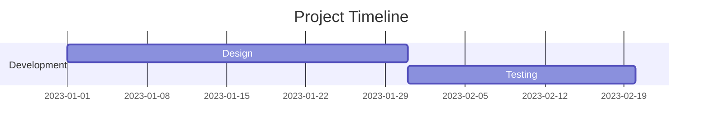

# 🚀 MODULE 2: Software Development Essentials  

## 🎯 Objectives  
- 📝 Describe software requirements  
- 🌐 Discuss website architecture  
- 💻 Explain programming steps  
- 📅 Manage future plans and schedules  

**🔍 Grammar Focus**  
| Concept | Examples |  
|---------|----------|  
| Passive Voice | "The code **was written** in Python" |  
| Requirements | *should*, *have to*, *need to* |  
| Future Schedules | *plan to*, *scheduled to*, *due to* |  

---

## 🖥️ Class 5: Requirements Analysis  

### 🔑 Key Concepts  
**Software Development Lifecycle:**  
1. 🗣️ Interview users and analyze needs  
2. ✍️ Write specifications  
3. 👨‍💻 Develop and test code  
4. ✅ Client approval  

### 🛠️ Activities  
1. **📖 Reading:** Systems analyst interview  
2. **📚 Vocabulary Matching:**  
   - `approve` → Give official permission  
   - `debug` → Fix code errors  
3. **🎧 Listening:** Pizza shop order system workflow  
4. **📊 Flowchart Completion:**  
   ```mermaid  
   graph TD  
     A[Start] --> B[Ask for toppings]  
     B --> C{Pepperoni?}
   ```

### ✨ Example Exercise
```markdown
- Complete with requirements:  
  "You [need to/should/have to] debug your code before submission"  
```

---

## 🌐 Class 6: Website Design
### � Key Concepts
| 🖥️ **Component**   | 🛠️ **Technology**    |
|-----------------|-------------------|
| `Frontend`      | HTML5, CSS        |
| `Backend`       | PHP, MySQL        |
| `Optimization`  | SEO techniques    |

### 🛠️ Activities
1. 🗣️ Speaking: "What makes a good Contact page?"
2. 📖 Case Study: Gaming fan site architecture
3. 🔄 Passive Voice Practice:
```diff
- Active: "They use PHP"  
+ Passive: "PHP is used"
```

### ✨ Example
```javascript
// Passive construction  
const website = {  
  framework: "React",  
  testedBy: "QA Team" // --> "is tested by QA Team"  
};  
```

---

## 🤖 Class 7: Programming Fundamentals
### 🔑 Core Concepts
| 🧠 Concept   | 💡 Example                  |
|-------------|----------------------------|
| **Variable**  | `int speed = 5;`         |
| **Constant**  | `const PI = 3.14;`       |
| **Control**   | "F key makes robot move" |

### 🛠️ Activities
1. 🎧 Listening: Robot control code discussion
2. 🔀 Flowchart Logic:
```plaintext
g_Move = 1 → "Go forward"  
g_Turn = -1 → "Rotate left"  
```

3. 💡 Make/Cause Examples:
- "Clear comments cause developers to understand faster"

---

## 📊 Class 8: Project Management
### 📅 Key Tools


### 🛠️ Activities
1. 📖 Vocabulary:
  - Milestone: Major project achievement
  - Feedback: Client evaluation

2. ✏️ Future Tense Practice:
  - "The beta is scheduled to launch on Friday"

### ✨ Deadline Example
```markdown
- [x] Code review (Due: Feb 15)  
- [ ] Client demo (Scheduled: Mar 1)
```

---

## 📚 Additional Resources
- 🔗 Passive Voice Exercises
- 📖 English for IT 2 - David Hill
```markdown
<details>
<summary>📌 Quick Grammar Cheat Sheet</summary>

| Tense        | Formula                 | Example                   |
|--------------|-------------------------|---------------------------|
| **Passive**  | be + past participle    | "The bug was fixed"       |
| **Future**   | be + scheduled to       | "We are due to deploy"    |

</details>
```
