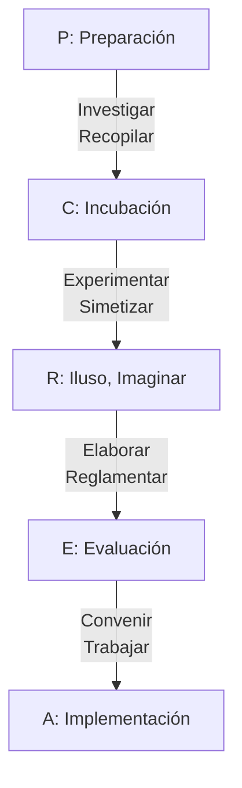

```mermaid
graph TD
    A[P: Preparación] -->|Investigar<br>Recopilar| B[C: Incubación]
    B -->|Experimentar<br>Simetizar| C[R: Iluso, Imaginar]
    C -->|Elaborar<br>Reglamentar| D[E: Evaluación]
    D -->|Convenir<br>Trabajar| E[A: Implementación]
```

