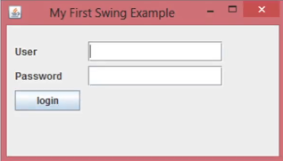
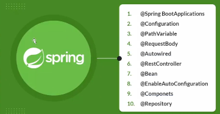

# BRIEF DE PROYECTO JAVA
--
En esta ocasión, se creará una aplicación de tienda de libros con las tecnologías de 'Swing' y 'SpringBoot'.

## ¿En qué consiste la aplicación que se va a desarrollar?
El usuario de la aplicación tendrá la posibilidad de ver el listado de libros disponibles en la tienda.
Además, podrá agregar libros, modificar los ya existentes y, también, eliminar libros del sistema.

## ¿Qué información se manejará en el sistema?
Algunas características son: el nombre del libro, el autor, su precio y la cantidad de libros en la tienda.

## ¿Qué tecnologías se van a utilizar para crear la aplicación?
Así como al construir una casa, se necesita tener un plano arquitectónico, al construir los sistemas se utilizará una arquitectura multicapas.
Esto permite tener organizado el código entre muchas ventajas más.

## ¿Cuál es la arquitectura que se utilizará en la aplicación?
Se utilizará una arquitectura de tres capas:
1. La capa de *presentación*:
    - Se utilizará la tecnología de 'swing'.
    

2. La capa de *negocio* o capa de *servicio*:
    - Se utilizará la tecnología de 'Spring'.
    

3. La capa de *datos*:
    - Se utilizará la tecnología de 'Java Persistence API (JPA)' con Hibernate y, para poder almacenar la información, se utilizará la basde de datos de MySQL.

## ¿Cómo se visualizará la aplicación?
Este será el resultado de la aplicación de libros.
Esta integración de tecnologías utilizando 'swing' y 'SpringBoot' resulta bastante interesante ya que se va a poder crecer la aplicación de tienda de libros tanto como sea necesario.

