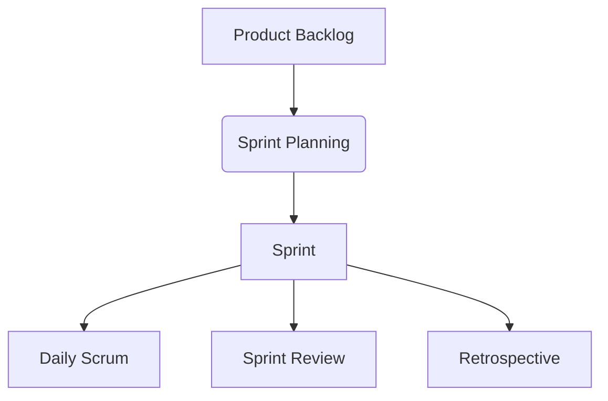
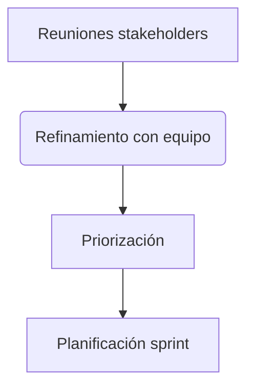

# 🚀 **MÉTODO SCRUM**  

## 🔍 **¿Qué es?**  
Scrum es un marco de trabajo colaborativo inspirado en equipos de rugby, donde:  
✔ **Aprendizaje continuo** a través de experiencias  
✔ **Autoorganización** para resolver problemas  
✔ **Reflexión constante** para mejora continua  

---

## 💻 **Scrum en Desarrollo**  
- Popular en equipos de software pero aplicable a cualquier trabajo en equipo  
- Combina reuniones, herramientas y roles estructurados  
- **Flexibilidad adaptativa**: evoluciona con requisitos cambiantes  

### 🔄 **Diferencia con Metodología Ágil**  
| Scrum | Ágil |  
|-------|------|  
| Marco de trabajo | Mentalidad |  
| Herramienta concreta | Filosofía de valores |  
| Implementación específica | Enfoque cultural |  

---

## 🏗️ **Marco de Trabajo Scrum**  
**Principios clave**:  
- Adaptación a cambios  
- Ciclos cortos de lanzamiento ("sprints")  
- Priorización dinámica  

---

## 🧰 **Artefactos Scrum**  
### 1️⃣ **Product Backlog**  
📌 *Lista maestra de trabajo pendiente*  
- Dinámica y priorizable  
- Gestionada por el **Product Owner**  

### 2️⃣ **Sprint Backlog**  
🎯 *Tareas seleccionadas para el sprint actual*  
- Flexible pero con objetivo claro  
- Definido en planificación de sprint  

### 3️⃣ **Incremento**  
🛠️ *Resultado tangible del sprint*  
- Versión funcional entregable  
- Definición de "Hecho" específica  

---

## ⏳ **Eventos Scrum**  
1. **Organización del backlog**  
2. **Planificación de sprint**  
3. **Sprint** (1-4 semanas)  
4. **Daily Scrum** (reunión diaria 15 min)  
5. **Revisión de sprint**  
6. **Retrospectiva**  

---

## **👥 Roles Clave**
### 🧑💼 Product Owner
- Máximo conocedor del producto
- Responsable del backlog y priorización
- Puente entre negocio y desarrollo

### 🧙♂️ Scrum Master
- Facilitador y coach
- Elimina obstáculos
- Garantiza seguimiento del marco

### 👩💻 Equipo Desarrollo
- Autoorganizado e interdisciplinario
- Responsable de entregar incrementos

---

## **🔍 Transparencia en Artefactos**
Pilares Scrum:
1. Transparencia
2. Inspección
3. Adaptación

> *"La transparencia es un proceso de aprendizaje continuo"*

---

## **📋 Gestión del Product Backlog**
### 📝 Elementos clave:
- Descripción detallada
- Orden de prioridad
- Estimación de esfuerzo
- Valor empresarial
- Criterios de aceptación

### 🔄 Proceso continuo:

---

## **💡 Ejemplo Práctico**
Backlog para sitio e-commerce:
1. Página de inicio
2. Página de producto
3. Formulario de pedido
4. Carrito de compras
5. Pasarela de pago
