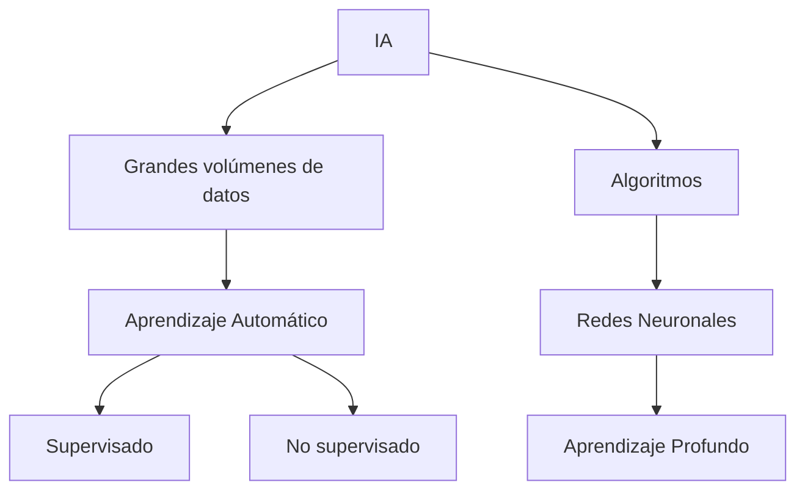
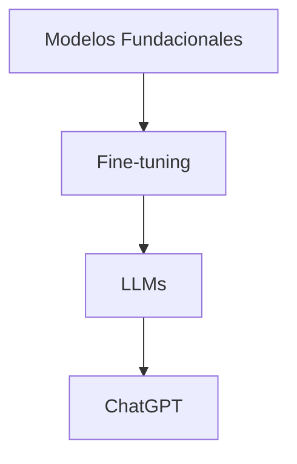

# 🤖 **Introducción a la IA**  

---

## 👥 **¿Quiénes trabajan con la Inteligencia Artificial?**  

| Grupo | Descripción | Ejemplo |
|-------|------------|---------|
| **Investigadores** 🧪 | Desarrollan nuevos modelos y algoritmos de IA. Publican en revistas académicas. | Papers en NeurIPS |
| **Desarrolladores** 💻 | Implementan aplicaciones usando modelos existentes. Enfocados en ingeniería de software. | Apps con TensorFlow |
| **Usuarios finales** 📱 | Utilizan herramientas de IA en su vida diaria. Validan su utilidad práctica. | ChatGPT para tareas |

---

## ⚙️ **¿Cómo opera la Inteligencia Artificial?**  


- Objetivo: Sistemas que realizan tareas humanas complejas
- Método: Entrenamiento con datos → Predicciones
- Evolución: Redes neuronales → Deep Learning

---

## **💬 Procesamiento del Lenguaje Natural (PLN)**
### ¿Por qué es revolucionario?
> *"Resolver el problema del contexto en el lenguaje humano"*
- Reto principal: Entender palabras en diferentes contextos
- Solución clave: Arquitectura Transformers
- Aplicaciones: Traducción, chatbots, análisis de texto

---

## **🛠️ Construyendo herramientas como ChatGPT**

- Modelos Fundacionales: Versiones generales adaptables
- LLMs: Modelos de Lenguaje a Gran Escala
- Proceso: Entrenamiento → Ajuste → Implementación

---

## **🏡 IA en la Vida Cotidiana**
### 🔧 Herramientas populares:

| Área       | Herramientas               |
|------------|----------------------------|
| 📝 **Texto**  | ChatGPT, Google Bard       |
| 🎨 **Imágenes** | DALI, Midjourney          |
| 🎵 **Audio**   | MusicLM, Otter            |

### 💡 Mejores prácticas:
- Prompts efectivos: Instrucciones claras + contexto relevante
- Ejemplo:
  *"Explica el machine learning como si tuviera 5 años, usando analogías simples"*

---

## **🌎 ¿Por qué todos deberíamos usar IA?**
```markdown
▸ 🚀 **Acelerador profesional**  
   - Automatiza lo repetitivo  
   - Enfócate en lo creativo  

▸ 🌐 **Nivelador competitivo**  
   - Herramientas accesibles  
   - Mismo poder que grandes empresas  

▸ 🔍 **Aliado estratégico**  
   - Anticipa tendencias  
   - Reduce riesgos  
```
- Productividad: Automatiza tareas repetitivas
- Toma de decisiones: Análisis basado en datos
- Impacto: Soluciones escalables en cualquier campo

> *✨ "La IA no reemplaza humanos, amplifica nuestras capacidades"*


