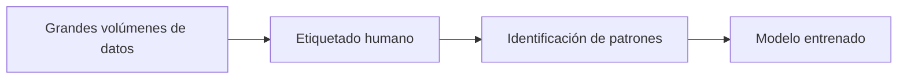
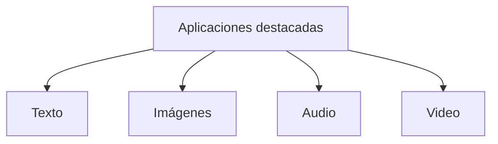
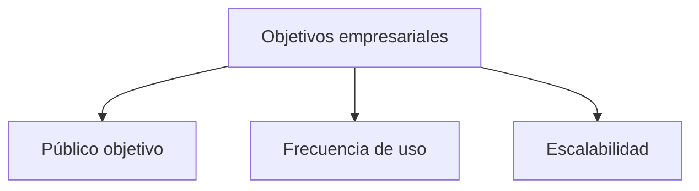
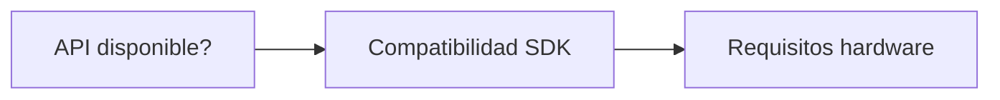

# 🤖 **IA: Inteligencia Artificial**  
*Una revolución tecnológica transformando nuestro presente y futuro*

---

## 🧠 **¿Cómo aprenden los modelos de IA?**  
*El entrenamiento: corazón del aprendizaje automático*


### Proceso clave:
- 📊 Datos etiquetados (ej: correos spam vs legítimos)
- 🔍 Análisis de patrones recurrentes
- 🏋️‍♂️ Iteraciones de ajuste fino

### Ejemplos prácticos:
- Procesamiento de lenguaje: Corpus con millones de palabras
- Generación de imágenes: Bases de datos con billones de imágenes descritas

---

## **💬 Modelos de Lenguaje a Gran Escala (LLMs)**
> *Los políglotas digitales del siglo XXI*

### 🏆 Principales características:

| Capacidad    | Ejemplo de Aplicación      |
|--------------|---------------------------|
| **Multilingüe** 🌐 | Traducción simultánea entre 50+ idiomas |
| **Generativa** ✍️  | Redacción de artículos, correos y contenido SEO |
| **Adaptativa** 🤖 | Chatbots para servicio al cliente 24/7 |

### Iconos tecnológicos:
- GPT-4 (OpenAI)
- ChatGPT
- Claude (Anthropic)

---

## **🎨 IA Generativa**
> *Creatividad artificial con propósito*



### Herramientas líderes:
- ✍️ Texto: ChatGPT, Gemini
- 🖼️ Imágenes: DALL-E 3, Midjourney
- 🎵 Audio: MusicLM, Udio

---

## **🏢 IA en el Mundo Empresarial**
> *Estrategia de implementación inteligente*

🔍 Evaluación de necesidades

### Checklist técnico:
- ✅ Integración con sistemas existentes
- ✅ Compatibilidad multiplataforma
- ✅ Cumplimiento normativo (GDPR)

---

## **💰 Análisis Costo-Beneficio**
> *Inversión inteligente en IA*
## 💡 Claves Financieras
- 🏷️ **Inicial**: Licencias/desarrollo  
- 🔄 **Operativo**: Mantenimiento/updates  
- 📉 **ROI**: Ganancia productividad  

- Ejemplo práctico:
```diff
+ Herramienta A: $10k/año - 40% ganancia eficiencia
- Herramienta B: $5k/año - 15% ganancia eficiencia
```

---

## **🖼️ Guía: Selección de IA Generativa de Imágenes**
> *Preguntas clave para decisores*

1. Definición de necesidades
  - ¿Generación realista o artística?
  - ¿Volumen mensual estimado?

2. Evaluación técnica


3. Consideraciones económicas
  - Modelo de pago (por uso/suscripción)
  - Costos ocultos (almacenamiento, entrenamiento)

> *💡 "La IA óptima es la que resuelve problemas específicos, no la más avanzada técnicamente"*
