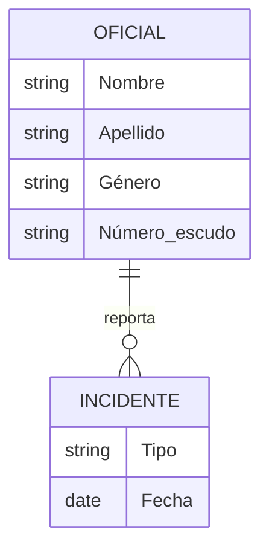

# 🏗️ **Estructura general de un modelo de datos conceptual**  

## 📐 Diseño del modelo  
🔹 Diseñar un modelo de datos conceptual requiere una comprensión de los tipos de componentes que se van a describir, y de cómo se relacionan entre sí.  

---  

## � Componentes fundamentales  

### 1️⃣ **Entidades**  
▫️ **Definición:** Cosas de la vida real (personas, objetos, eventos, entre otras) sobre las que la base de datos contiene información.  
▫️ **Ejemplos:**  
   - `Oficiales`  
   - `Incidentes`  
   - `Videos`  
   - `Prisioneros`  
   - `Prisiones`  

▫️ **Tipos de entidad (entity type):** Describen el tipo de información que se está registrando:  
   - `Persona`  
   - `Lugar`  
   - `Evento`  

---  

### 2️⃣ **Relaciones**  
▫️ **Definición:** Cómo se asocian las diferentes entidades entre sí.  

▫️ **Características:**  
   - Pueden representar conexiones de la vida real.  
   - Se expresan frecuentemente con la fórmula:  
     **sustantivo-verbo-sustantivo**  
     *(ejemplo: "alumno estudia asignatura")*  

---  

### 3️⃣ **Atributos**  
▫️ **Definición:** Aspectos o propiedades de las entidades y/o relaciones.  

▫️ **En la práctica:**  
   - En bases de datos, se visualizan como **campos** dentro de cada entidad.  

▫️ **Ejemplo (Entidad 'Oficial'):**  
   - `Nombre`  
   - `Apellido`  
   - `Género`  
   - `Ubicación`  
   - `Número de escudo`  

---  

## 🖇️ Diagrama conceptual  

> *(Ejemplo simplificado de relaciones entre entidades)*
