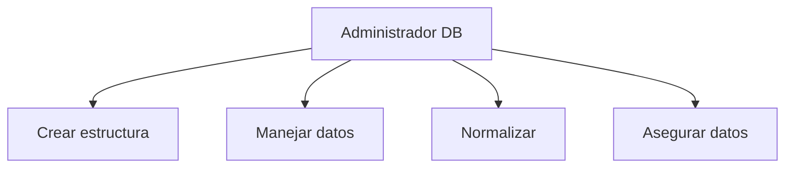

# 🗄️ Introducción a Bases de Datos No Relacionales

## 👨💻 **Administrador de Base de Datos**
Profesional encargado de gestionar y organizar los datos empresariales.



## **🔄 Tipos de Bases de Datos**
### 📊 Comparativa RDBMS vs NoSQL
| 📌 **Característica**  | 🔗 **Relacional**         | 🍃 **NoSQL**              |
|-----------------------|--------------------------|--------------------------|
| **Estructura**        | Tablas (filas/columnas)  | Documentos/colecciones   |
| **Esquema**           | Fijo (predefinido)       | Flexible (dinámico)      |
| **Escalabilidad**     | Vertical (1 servidor)    | Horizontal (múltiples nodos) |
| **Consultas**         | SQL                      | Lenguajes específicos    |
| **Transacciones**     | ACID                     | BASE                     |
| **Rendimiento**       | Optimizado para writes   | Optimizado para reads    |
| **Ejemplos**          | MySQL, PostgreSQL        | MongoDB, Cassandra       |
| **Casos de Uso**      | Datos estructurados      | Big Data, IoT            |

### 🧩 Otros Tipos
1. Orientada a Objetos
```python
class Cliente:
    def __init__(self, nombre, id):
        self.nombre = nombre  # Atributo
        self.id = id        # Atributo
```

2. Distribuidas
   - https://via.placeholder.com/400x200?text=Servidores+conectados+en+red

## **💾 Tipos de Datos**
### 📌 Tabla Comparativa
## 📊 Tipos de Datos en Bases de Datos

| Categoría   | Tipo       | Ejemplo    | Tamaño      | Uso típico                |
|-------------|------------|------------|-------------|---------------------------|
| **Numérico** | `Entero`  | `42`       | 4 bytes     | IDs, cantidades           |
|             | `Real`    | `3.1416`   | 8 bytes     | Valores decimales         |
| **Texto**    | `Carácter`| `'A'`      | 1 byte      | Flags, códigos            |
|             | `Cadena`  | `"Hola"`   | Variable    | Nombres, descripciones    |
| **Lógico**   | `Booleano`| `True`     | 1 bit       | Estados binarios          |

### 📌 Notas clave:
- 🔢 **Numéricos**: Precisión definida (entero/real)
- 🔤 **Texto**: Codificación UTF-8 por defecto
- ✅ **Booleanos**: Solo 2 valores posibles (`True`/`False`)

## **🛠️ Sistemas Gestores**
### MongoDB Atlas
```bash
# Comando básico
mongoimport --db usuarios --collection clientes --file datos.json
```

Ejemplos prácticos
```diff
+ Nota: Las DB NoSQL son ideales para datos semi-estructurados
- Precaución: Requieren diferente enfoque de modelado
```

> *"En la era del Big Data, la flexibilidad de las bases NoSQL se ha vuelto esencial" - Martin Fowler*
