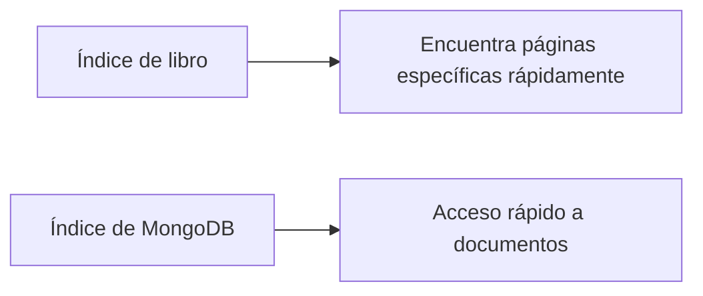
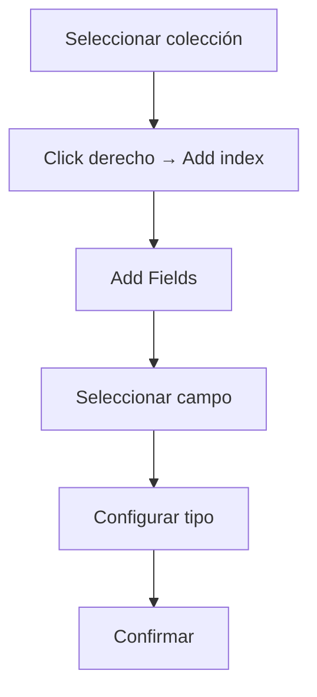

# 🍃 MongoDB: Índices
## 🔍 ¿Qué son los índices?
Los índices son estructuras de datos que mantienen información acerca de los valores de campos específicos. Son identificadores que permiten acceder más rápido a los datos.

## 📚 Funcionalidad (Analogía con libros)


### Beneficios:
- Evita búsquedas secuenciales (documento por documento)
- Optimiza el rendimiento en bases de datos extensas
- Similar a usar el índice de un libro vs. buscar página por página

## ⚠️ Importancia de especificar índices
- Sin índice:
```javascript
// Búsqueda lenta (escaneo completo)
db.paso.find({"nombre": "carlos"})
```
- Con índice:
```javascript
// Búsqueda eficiente
db.paso.find({"_id": ObjectId("...")})
```

## 🛠️ Consideraciones al trabajar con índices
| 📌 Aspecto        | 🔍 Detalle                                  |
|-------------------|--------------------------------------------|
| 🛠️ Creación manual | Debemos crearlos explícitamente            |
| 🚫 Límite         | Máximo 40 índices por colección            |
| ⚙️ Índice por defecto | `_id` se crea automáticamente             |
| 🔄 Mantenimiento  | Requieren reconstrucción/optimización periódica |

## 🏗️ Creación de índices
Ejemplo básico
```javascript
use paso
db.paso.insertMany([
  {"nombre": "Hugo", "apellido": "Garcia"},
  {"nombre": "Lucia", "apellido": "Ramirez"},
  {"nombre": "carlos", "apellido": "martinez"}
])

// Ver índices existentes
db.paso.getIndexes()
// Salida: [{"v":2, "key":{"_id":1}, "name":"_id_"}]

// Crear nuevo índice
db.paso.createIndex({"apellido":1})
```

Índices únicos
```javascript
db.paso2.insertMany([
  {"usuario": "Fer_4T", "contraseña": "12345d", "correo": "fer@ejemplo.com"},
  {"usuario": "maria", "contraseña": "12345f", "correo": "maria@ejemplo.com"},
  {"usuario": "kev", "contraseña": "12345k", "correo": "kev@ejemplo.com"}
])

// Crear índice único (evita duplicados)
db.paso2.createIndex({"correo":1}, {unique: true})
```

## ⏳ Indexación en segundo plano
```javascript
use segundo
db.ejemplo.insertMany([
  {"nombre":"lautaro", "edad": 15, "fecha": new Date()},
  {"nombre":"gabriela", "edad": 16, "fecha": new Date()},
  {"nombre":"natalia", "edad": 19, "fecha": new Date()},
  {"nombre":"david", "edad": 20, "fecha": new Date()}
])

// Crear índices en background (no bloqueante)
db.ejemplo.createIndex({"nombre":1}, {background: true})
db.ejemplo.createIndex({"fecha":1}, {background: true})

// Ver todos los índices
db.ejemplo.getIndexes()
```

Ventajas de `background: true`:
- No interrumpe operaciones concurrentes
- Ideal para entornos productivos
- Usado frecuentemente en empresas

### 🖥️ Creación de índices en Studio 3T
1. Seleccionar la colección (ej: `Estudiantes`)
2. Click derecho → `Add index`
3. En el panel:
   - Click en `Add Field(s)...`
   - Seleccionar campo (ej: name)
   - Configurar tipo de índice
4.Confirmar creación

